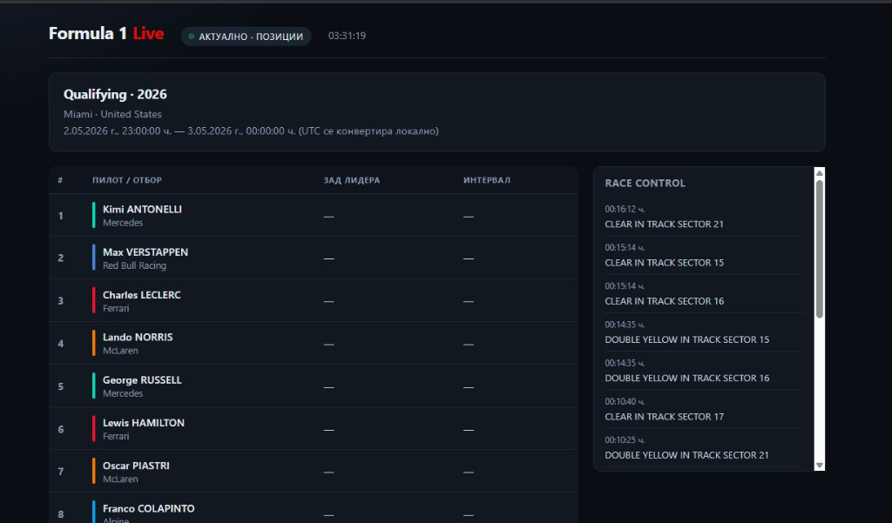

# f1_live_results

Малък уеб проект (SWP): PHP backend + JavaScript на клиента за показване на **текуща/последна F1 сесия** — класиране, интервали (при състезание) и скорошни съобщения от Race Control. Данните идват от публичния **OpenF1** API.

## Преглед на интерфейса



---

## Изисквания

| Компонент | Версия / бележки |
|-----------|------------------|
| **PHP** | **8.0+** (препоръчително **8.1** или по-нова). Използва се `declare(strict_types=1)`. |
| Разширения | `openssl` (HTTPS към `api.openf1.org`), `json`, `file_get_contents` / потоков HTTP |
| Сървър | Apache с PHP (напр. **WAMP**) или друг PHP-capable host |
| Браузър | Модерен браузър с ES6+ (за `fetch`, шаблонни низове) |

---

## Използван API

- **Име:** [OpenF1](https://openf1.org/)
- **Базов адрес:** `https://api.openf1.org/v1`
- **Документация:** [openf1.org/docs](https://openf1.org/docs/)
- **Какво се ползва в проекта:** агрегирани заявки през `api/live.php` към крайни точки като `sessions`, `drivers`, `intervals`, `position`, `race_control` (с параметър `session_key=latest` където е подходящо).
- **Лиценз / достъп:** исторически данни са достъпни без ключ; за условията на **реално време** и лимити виж официалната страница на OpenF1.

Проектът не изисква собствен API ключ.

---

## Структура на проекта

```
f1_live_results/
├── index.php          # Главна страница (UI + клиентски JS, опресняване ~5 s)
├── api/
│   └── live.php       # JSON агрегатор към OpenF1
├── docs/
│   └── screenshot.png # Илюстрация за README
└── README.md
```

---

## Инсталация и стартиране

1. Клонирай хранилището или копирай папката в root на уеб сървъра (напр. `www\f1`).
2. Увери се, че PHP има достъп до изходящи HTTPS заявки към `api.openf1.org`.
3. Отвори в браузър: `http://localhost/f1/` (пътят зависи от настройките на Apache/WAMP).

---

## Банер за бисквитки (Cookies)

Това статично приложение **не записва собствени бисквитки за анализ или реклама** в подразбиран код. Не се зареждат външни тракери.

- Ако в бъдеще се добавят услуги (Google Analytics, рекламни мрежи и т.н.), трябва да се покаже съгласие преди неесенциални бисквитки, съгласно приложимото право (в т.ч. GDPR за потребители от ЕС).
- Технически/сесийни бисквитки (ако ги въведе хостингът) обикновено са допустими за работа на сайта.

Този раздел в README описва политиката; при нужда добави реален банер в `index.php` и връзки към страниците „Поверителност“ / „Условия“.

---

## Условия за ползване

1. Проектът е предоставен „както е“, без гаранция за непрекъсната наличност на данни или на услугата на OpenF1.
2. Данните са с произход от трета страна (OpenF1 / официални източници зад API). Авторът на този проект не носи отговорност за грешки или закъснения в данните.
3. Използването на търговски марки и имена (Formula 1 и др.) следва правилата на съответните притежатели; този проект е некомерсиален фен инструмент, освен ако не промениш предназначението.
4. Забранено е използването на проекта по начин, който нарушава закона или условията на OpenF1.

---

## Политика за поверителност

1. **Лични данни:** Този минималистичен клиент не изисква регистрация и не съхранява съзнателно лични данни на сървъра на приложението.
2. **Сървърни логове:** Уеб сървърът (Apache и др.) може да записва IP адрес, час и заявени URL — управлението им е отговорност на администратора на хостинга.
3. **Трети страни:** При зареждане на данни браузърът (чрез твоя PHP backend) се свързва с `api.openf1.org`. Обработката на данни от страна на OpenF1 се урежда от тяхната политика.
4. **Промени:** При добавяне на анализ, формуляри или бисквитки, актуализирай тази политика и банера за съгласие.

---

## Често задавани въпроси (ЧЗВ)

| Въпрос | Отговор |
|--------|---------|
| Защо няма данни или колоните са с „—“? | При квалификация/сесии без състезателни интервали OpenF1 често няма полета „зад лидера“ / „интервал“; при състезание се ползват интервали. |
| Защо понякога има пауза при опресняване? | Мрежата или API могат временно да не отговорят; интерфейсът показва неутрален статус и опитва отново. |
| Нужен ли е API ключ? | За текущата интеграция — не (виж документацията на OpenF1 за бъдещи промени). |
| Колко често се обновява? | Клиентът прави заявка приблизително на всеки **5 секунди**. |

---

## Карта на сайта (Sitemap)

Логически адреси за този проект (настрой според реалния ти base URL):

| URL | Описание |
|-----|----------|
| `/` или `/index.php` | Начална страница — живо табло |
| `/api/live.php` | JSON endpoint (за AJAX; не е предвидена за директно отваряне от потребители) |

При добавяне на отделни страници (напр. `/privacy.php`, `/terms.php`) ги включи тук.

---

## Лиценз

Уточни лиценза на хранилището (напр. MIT) според предпочитанията си — добави файл `LICENSE` при нужда.

---

## Автор

Репозиторий: **sasho-krist** / **f1_live_results** (виж GitHub About).
